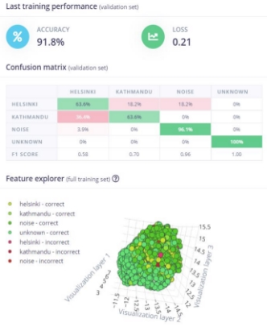
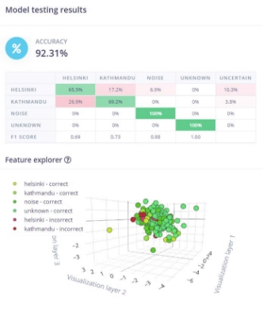


1. **INTRODUCTION**

The goal of the project is to train a machine learning model embedded on the Nano 33 BLE sense to perform audio classification, specifically recognising and classifying two different city names. The following city names were used in this classification task: 'Helsinki' and 'Kathmandu.' The user can ask the system questions such as "How is the weather in Helsinki?" or "What is the weather in Kathmandu?" Even with background noise and clutter, the created system would be able to identify city names from the user's question. This audio classification model was built, developed, and deployed using the EdgeImpulse development platform.

2. **PERFORMED TASKS**
1. **Environment Setup**

To begin, an EdgeImpulse account was created in which all data collection, feature extraction, training, and testing would take place. Similarly, Edge Impulse CLI was installed on the local machine to allow Arduino to communicate with the EdgeImpulse cloud, and Arduino CLI was installed to compile and upload the trained model to the Arduino board. Finally, the Edge Impulse firmware was installed on the Nano 33 Sense board, which was then connected to the Edge Impulse as shown in figure 1.

**Figure 1:** Connecting Arduino to Edge Impulse

2. **Data Collection**

After connecting the development board to EdgeImpulse, audio data was collected from the board. Based on the question, the audio data was labelled 'Helsinki' or 'Kathmandu' in EdgeImpulse's 'Data Acquisition’ module. The data were sampled at a frequency of 16kHz for 5 seconds. The first data set collected consisted of recordings of real people with various accents and background noise asking questions such as 'What is the weather in Helsinki?' and 'What is the weather in Kathmandu?'

To increase the sample size, AI-based voice data asking the same questions were recorded. The synthetic data was generated from people with various accents, pitch, and demographics. The total time spent collecting data for both labels was 16 minutes and 47 seconds as shown in figure 2. Each label had audio that lasted more than 8 minutes. Helsinki had 101 samples, while Kathmandu had 103.

**Figure 2:** Total time for 2 labels- Helsinki and Kathmandu

In addition, noise and unknown samples were introduced into the data. The assumption was that if the model was only trained with labels like 'Helsinki' or 'Kathmandu,' it would be unable to distinguish between right and wrong in new data that did not contain these words. The assumption was that more diverse data would result in better model results. However, a separate dataset containing only the city names was extracted from the full-sentence dataset to see how it compares to the model trained on full sentences.

The noise data included background noise such as TV playing, vehicle sound, and so on. The unknown data, on the other hand, contained random words like cat, dog, and so on. There were four labels in total: 'Helsinki,' 'Kathmandu,' 'noise,' and 'unknown,' each with around 8 minutes of audio data as shown in figure 3.

 

**Figure 3:** The first picture shows the total data having 4 labels. The second picture shows the number of samples collected for each label

After collecting all of the data, it was resampled into training and testing data at a rate of about 80% and 20%, respectively shown in figure 4.

**Figure 4:** Shows the time each label is divided into training and testing set

3. **Designing Impulse**

The next step was to develop an impulse to extract features and train the neural network. The MFCC (Mel Frequency Cepstral Coefficients) technique was used to extract the feature. Various window sizes and window increase sizes were tested to see if they affected model accuracy. Higher window sizes were discovered to require more buffer memory, resulting in a memory error when the model was deployed on the Arduino. As shown in figure 5, the optimal parameters for the window size were 2000ms and 500ms for the window increase size.

**Figure 5:** Optimal window parameters of the model

Following that, several neural network models were trained on the audio datasets collected. Data augmentation was also used to add minimal noise to the datasets (as shown in figure 6). The underlying neural network architecture was a one-dimensional convolutional neural network (CNN) (as shown in figure 8). In order to solve the model's overfitting, different models were trained with different parameters such as the number of epochs to train and the learning rate. As shown in figure 7, it was discovered that 70 epochs and a learning rate of 0.05 were the optimal parameters.

**Figure 6:** Data Augmentation in the model

**Figure 7:** Additional parameters of the model

The result of feature extraction was high-dimensional data with 3250 features, which was used as the input layer of the CNN. The edge impulse platform enabled us to define our own neural network architecture in expert mode using TensorFlow.keras library. However, we decided to stick with the default architecture because it performed well. Figure 8 depicts the architecture we used for our model.

**Figure 8:** Architecture of the Neural Network

4. **Deployment**

Finally, the most effective neural network model was chosen and deployed on the Arduino Nano 33 BLE sense. The model was downloaded as an Arduino library written in C++ for this purpose. The model was tested on both continuous audio signals and two-second recordings. Figure 9 shows the prediction output of the best model.

**Figure 9:** Classification results on live data from Arduino

3. **RESULTS**

As previously discussed, several neural network models were trained and tested using various datasets and feature extraction and neural network model parameters. We used an iterative process in which we experimented with datasets containing full sentences and then only city names, as well as adding noise and unknown data to the dataset. Similarly, various parameters were tested in order to reduce overfitting and see how the model performed. The outcomes were as follows:

1. **With full sentences and only city names**

First, as shown in figure 10, the model with only the full sentences had a training accuracy of 64% and a testing accuracy of 50%. However, when the dataset was trimmed to only include the city names, the training accuracy increased to 80%, but the testing accuracy dropped to 33% because the testing dataset included full sentences. The purpose of using full sentences for testing was to see if the model could identify the city names in the full sentences.

**Figure 10:** Model performance on data with full sentences

2. **With leading and trailing silence trimmed**

The dataset was then processed to trim the leading and trailing silence, leaving only the full sentences for training. Even though the trimmed dataset had higher training accuracy (in figure 11), the dataset without leading and trailing silence had less overfitting. Both models had a window size of 100ms.

**Figure 11:** Model performance on trimmed data

3. **With noise, unknown data and changed parameters**

The training and testing accuracy increased dramatically when the window size was increased to 3999ms from 100ms and the window increase size from 100ms to 500ms. Window increase is the size to slide over the audio sample when it is larger than the specified window size. Likewise, the training epochs were reduced to 70 from 100 to reduce overfitting (figure 12).

**Figure 12:** Model performance on changed window size and epochs

Similarly, when noise and unknown data were added to the dataset, overfitting decreased dramatically, as shown in the figures below. The training and testing accuracy was greater than 90 percent which is impressive. When the unknown data was added, however, the overfitting increased, which was corrected by increasing the window size to 5000ms from 3999ms and decreasing the window sliding size to 100ms (figure 13).

**Figure 13:** Model performance on data with noise and unknown words with changed parameters

Version 2 shown in the figure above was the best performing model, with a training accuracy of 98 per cent and testing accuracy of 97 percent, but when we tried to deploy it in the Arduino, the buffer memory was insufficient, and we kept getting a buffer memory error. As a result, the window size was reduced to 2000ms, and the deployment was completed successfully. However, accuracy suffered, falling to 92 percent as shown in figure 14. But this model may be considered the best model that can be successfully deployed on the Arduino Nano 33 BLE sense board.

| **Discussion/Conclusion** |      |  |
| ---------------------------------------------------------------------------------------- | :--- | --------------------------------------------------------------- |
|                                                                                          |      |                                                                 |
|                                                                                          |      |                                                                 |
|                                                                                          |
|                                                                                          |      |                                                                 |
|                                                                                          |      |                                                                 |
|                                                                                          |      |                                                                 |
**Figure 14:** The first picture shows the training performance of the model and the second picture shows the testing performance of the model

4. **DISCUSSION**

The model performs well on real-world data because the training dataset contained a sufficient number of audio samples with varying accents and pitches. Figure 14 shows that the model can accurately predict noise and unknown words. However, the model only recognizes 'Helsinki' and 'Kathmandu' about two out of every three times. This could be due to an overlap between the two sentences, i.e. "What is the weather in," as well as the fact that half of the data set contained synthetic AI-generated audio data.

Although the model performs well with real-world data, it can be improved by using only real-world data rather than AI-generated data. The AI-generated voice differs slightly from a real human voice and has a fixed tonality, which may impair model performance. Similarly, it was discovered that the model would perform better if the window size was close to the length of the audio in the training dataset. Additionally, the ability to retrieve weather information from the internet could be added.

5. **LINKS**

**Video: [link**](https://drive.google.com/file/d/1rJc8_FerMrilo4f-YniGXwXV5bDJKjCP/view?usp=sharing)**
